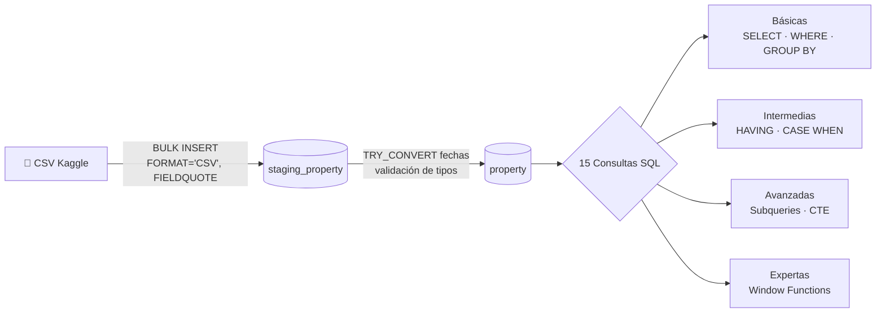
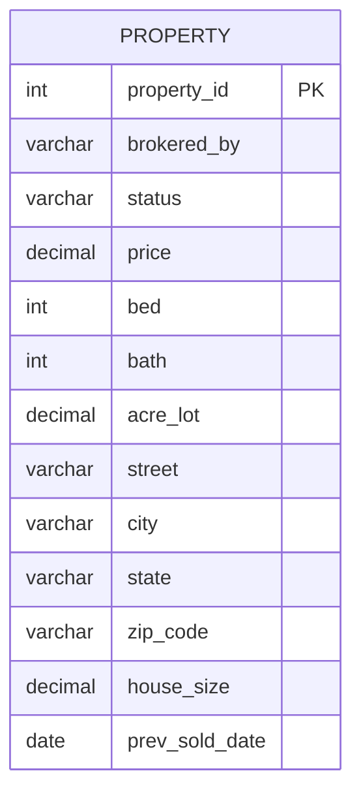
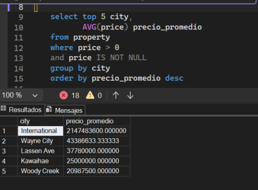
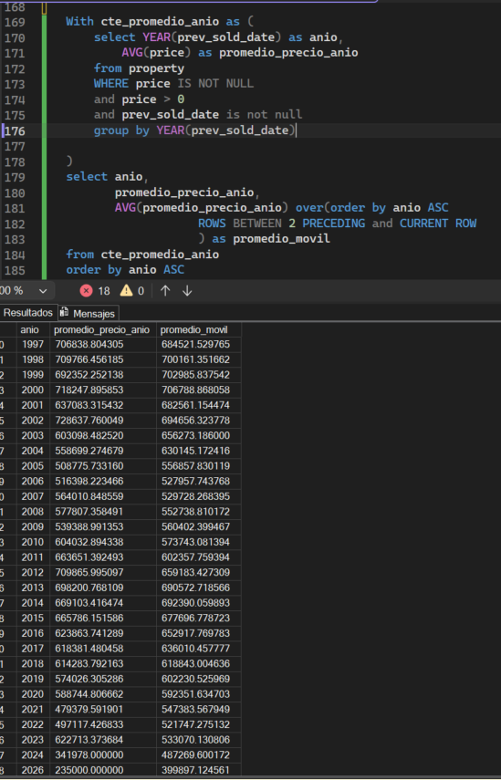

<div align="center">

# 🏠 Análisis del Mercado Inmobiliario en USA con SQL

### Un pipeline completo de datos: de CSV crudo a insights de negocio, usando exclusivamente T-SQL


</div>

---

## 📑 Tabla de contenido

- [Descripción del problema](#-descripción-del-problema)
- [Dataset](#️-dataset)
- [Arquitectura del pipeline](#-arquitectura-del-pipeline)
- [Modelo de datos](#-modelo-de-datos)
- [Retos técnicos resueltos](#-retos-técnicos-resueltos)
- [Tratamiento de datos nulos](#-tratamiento-de-datos-nulos)
- [Las 15 preguntas de negocio](#-las-15-preguntas-de-negocio)
- [Insights principales](#-insights-principales)
- [Capturas de resultados](#-capturas-de-resultados)
- [Cómo reproducir este proyecto](#-cómo-reproducir-este-proyecto)
- [Estructura del repositorio](#-estructura-del-repositorio)
- [Habilidades demostradas](#-habilidades-demostradas)
- [Autor](#-autor)

---

## 📋 Descripción del problema

Este proyecto analiza el **[USA Real Estate Dataset]([https://www.kaggle.com](https://www.kaggle.com/datasets/ahmedshahriarsakib/usa-real-estate-dataset)/)** para responder preguntas reales de negocio sobre precios, distribución geográfica y tendencias del mercado inmobiliario en Estados Unidos — **usando únicamente SQL**, desde la carga del dato crudo hasta análisis con funciones de ventana.

El objetivo no fue solo escribir consultas, sino simular el flujo de trabajo real de un analista: cargar datos imperfectos, resolver los problemas que aparecen en el camino, y documentar decisiones con criterio.

## 🗂️ Dataset

| Detalle | Valor |
|---|---|
| Fuente | Kaggle — USA Real Estate Dataset |
| Registros cargados | *(pega aquí el resultado de `SELECT COUNT(*) FROM property`)* |
| Formato original | CSV |
| Columnas | `brokered_by`, `status`, `price`, `bed`, `bath`, `acre_lot`, `street`, `city`, `state`, `zip_code`, `house_size`, `prev_sold_date` |

## 🏗️ Arquitectura del pipeline



## 🧩 Modelo de datos



## 🔧 Retos técnicos resueltos

Durante la carga de más de dos millones de registros aparecieron varios problemas reales de calidad de datos, todos resueltos directamente en T-SQL:

| Problema | Causa | Solución |
|---|---|---|
| `Cannot bulk load... column too long` | `ROWTERMINATOR` no coincidía con el fin de línea real del archivo | Ajuste a `0x0a` / `\r\n` |
| Columnas desalineadas (`state` con datos de `zip_code`) | Direcciones con comas internas (`"Pittsboro, NC"`) sin manejo de comillas | `FORMAT = 'CSV'` + `FIELDQUOTE = '"'` |
| `Data conversion error` en `prev_sold_date` | Fechas vacías o mal formateadas | Carga como `VARCHAR` + `TRY_CONVERT(date, ...)` |
| `String or binary data would be truncated` | `zip_code` con formato ZIP+4 más largo de lo esperado | Ampliación de `varchar(10)` a `varchar(20)` |

## 🧹 Tratamiento de datos nulos

En lugar de eliminar registros con valores nulos de forma permanente, se optó por **preservar la tabla completa** y aplicar filtros específicos en cada consulta (`WHERE price > 0 AND price IS NOT NULL`) o sustituciones con `COALESCE`, por las siguientes razones:

- **Los nulos no siempre significan datos faltantes.** `prev_sold_date` es nulo en propiedades `ready_to_build`, que por definición nunca se han vendido antes.
- **Cada pregunta usa columnas distintas** — eliminar cualquier fila con algún nulo habría descartado registros válidos para preguntas que no dependen de esa columna.
- **Transparencia:** filtrar dentro de cada consulta deja explícito, en el propio código, qué criterio de validez se usó.
- Para columnas categóricas como `city`, se usó `COALESCE(city, 'Sin Ciudad')`, conservando el registro en vez de descartarlo.

## ❓ Las 15 preguntas de negocio

| # | Pregunta | Técnica principal |
|---|---|---|
| 1 | ¿Cuál es el precio promedio de las propiedades? | `AVG` · `WHERE` |
| 2 | ¿Qué ciudades tienen las propiedades más caras? | `GROUP BY` · `ORDER BY` |
| 3 | ¿Cuál es el precio promedio por estado? | `GROUP BY` |
| 4 | ¿Dónde existe mayor cantidad de propiedades? | `COUNT` · `GROUP BY` |
| 5 | ¿Cómo cambia el precio según número de dormitorios? | `GROUP BY` |
| 6 | ¿Qué relación existe entre tamaño y precio? | `CASE WHEN` |
| 7 | ¿Cuáles son las 10 propiedades más caras? | `TOP` · `ORDER BY` |
| 8 | ¿Cuál es la propiedad más cara de cada ciudad? | `DENSE_RANK() OVER (PARTITION BY)` |
| 9 | ¿Qué propiedades están sobre el precio promedio de su ciudad? | Subquery correlacionado |
| 10 | ¿Cuál es el ranking de propiedades por precio dentro de cada ciudad? | `DENSE_RANK()` |
| 11 | ¿Qué porcentaje de propiedades corresponde a cada estado? | `CTE` |
| 12 | ¿Cuánto se aleja cada propiedad del promedio de su zona? | `AVG() OVER (PARTITION BY)` |
| 13 | ¿Cómo evolucionan los precios en el tiempo? | `LAG()` |
| 14 | ¿Cuál es el promedio móvil de precios? | `AVG() OVER (ROWS BETWEEN...)` |
| 15 | ¿Qué ciudades combinan alta oferta + precios elevados? | Subquery anidado + `CTE` |

Todas las consultas están comentadas en [`consultas.sql`](./consultas.sql).

## 💡 Insights principales


1. **Dispersión de precios entre estados** El precio promedio nacional es de **$524,261.50**. Sin embargo, varía drásticamente por estado: Hawaii lidera con un promedio de $1,240,095.30, casi el doble del promedio nacional, mientras que West Virginia cierra la tabla       con $240,045.93 — una diferencia de más de    5 veces entre el estado más caro y el más económico (excluyendo valores nulos y el registro atípico de "New Brunswick", que con solo $2,500 es claramente un dato mal cargado).
2. **Detección de outliers antes de confiar en rankings de precio** Al ejecutar la consulta de "ciudades más caras" sin un filtro de cantidad mínima de propiedades, el resultado arroja cifras imposibles: una ciudad llamada "International" con un precio promedio de         $2,147,483,600 (más de 2 mil millones de dólares), y otras como "Wayne City" ($43.3M) o "Kawaihae" ($25M). Esto no refleja mercados reales, sino errores de captura de datos o valores centinela (2,147,483,647 es, de hecho, el valor máximo de un entero de 32 bits — un   clásico error de sistema, no un precio real). Esto es un hallazgo de calidad de datos crucial: antes de reportar "ciudades más caras", hay que aplicar HAVING COUNT(*) > N para excluir ciudades con muy pocas propiedades, y filtrar valores de precio absurdamente altos.
3. **La relación tamaño-precio no es lineal, y se revierte en el rango más grande** El precio promedio crece consistentemente con el tamaño hasta el rango de 3,000-3,999 sqft ($940,514.55, el salto más grande viene de 2,000-2,999 sqft con $607,583.94, un incremento del    54.7%). Pero en el rango de 4,000+ sqft, el precio promedio cae a $611,227.45 — por debajo incluso del rango anterior. Esto sugiere que las propiedades más grandes del dataset probablemente incluyen terrenos rurales de gran tamaño con construcciones económicas, no      necesariamente mansiones de lujo, rompiendo la intuición de "más grande = más caro"..
4. **Distribución equilibrada sobre el promedio local:** el 34.37% de las propiedades (764,462 de 2,224,561) supera el precio promedio de su ciudad — una distribución razonable, sin dominancia extrema de outliers.
5. **Mercados de lujo con demanda sostenida:** ciudades como Nueva York (12,634 propiedades, $2.27M promedio), Los Ángeles (8,984, $1.92M) y San Francisco (4,605, $1.77M) combinan alta oferta y precios elevados de forma consistente — a diferencia de los outliers de datos del insight 2, aquí miles de transacciones reales sostienen el precio alto.

## 📸 Capturas de resultados






## 🚀 Cómo reproducir este proyecto

1. Descarga el dataset desde Kaggle.
2. Ejecuta `scripts/create_tables.sql` para crear `property` y `staging_property`.
3. Ajusta la ruta del archivo CSV en el `BULK INSERT` dentro de `scripts/load_data.sql`.
4. Ejecuta `scripts/load_data.sql` para cargar y transferir los datos.
5. Ejecuta `consultas.sql` para correr las 15 preguntas de análisis.

## 📁 Estructura del repositorio

```
├── dataset/              → CSV original (o enlace a Kaggle si pesa mucho)
├── scripts/
│   ├── create_tables.sql → creación de property y staging_property
│   └── load_data.sql     → BULK INSERT + transferencia a tabla final
├── consultas.sql         → las 15 consultas de negocio, comentadas
├── screenshots/          → evidencia visual de resultados
└── README.md             → este archivo
```

## 🧠 Habilidades demostradas


-critical)
-critical)
-critical)
%20OVER()-critical)


## 👤 Autor

**Paulo Andres Mancera Silva**

---
<div align="center">

⭐ Si este proyecto te resultó útil, considera dejar una estrella en el repositorio

</div>
